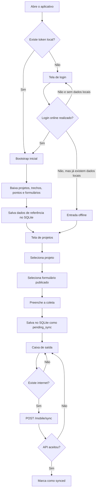

# Aplicativo Mobile — Arqueologia Brandt

Aplicativo Android em Flutter para coleta de dados arqueológicos em campo, com funcionamento **offline-first**, armazenamento local em SQLite, captura de GPS, registro de fotos e sincronização com a API do Sistema de Acompanhamento Arqueológico Brandt.

Este README descreve o comportamento que existe atualmente no código. Ele serve como guia para:

- arqueólogos e usuários de campo;
- desenvolvedores Flutter;
- pessoas responsáveis por configurar a API;
- equipe de testes;
- responsáveis por gerar e distribuir o APK.

> **Escopo atual:** o repositório contém a implementação Android. Não existem, neste diretório, projetos nativos configurados para iOS, web, Windows, macOS ou Linux.

---

## Sumário

1. [O que o aplicativo faz](#o-que-o-aplicativo-faz)
2. [Como o fluxo funciona](#como-o-fluxo-funciona)
3. [Funcionamento offline-first](#funcionamento-offline-first)
4. [Telas do aplicativo](#telas-do-aplicativo)
5. [Regras da coleta](#regras-da-coleta)
6. [Sincronização com o servidor](#sincronização-com-o-servidor)
7. [Configuração da URL da API](#configuração-da-url-da-api)
8. [Credenciais de desenvolvimento](#credenciais-de-desenvolvimento)
9. [Pré-requisitos](#pré-requisitos)
10. [Como executar o aplicativo](#como-executar-o-aplicativo)
11. [Como executar com uma API local](#como-executar-com-uma-api-local)
12. [Permissões Android](#permissões-android)
13. [Arquitetura do código](#arquitetura-do-código)
14. [Banco de dados local](#banco-de-dados-local)
15. [Integração com a API](#integração-com-a-api)
16. [Principais dependências](#principais-dependências)
17. [Testes e validações](#testes-e-validações)
18. [Geração de APK](#geração-de-apk)
19. [Solução de problemas](#solução-de-problemas)
20. [Limitações atuais](#limitações-atuais)
21. [Checklist antes de produção](#checklist-antes-de-produção)

---

## O que o aplicativo faz

O aplicativo foi criado para permitir que um arqueólogo trabalhe em campo mesmo quando não há internet disponível.

As funções implementadas atualmente são:

- autenticação por e-mail e senha;
- armazenamento local do token de acesso;
- download inicial dos dados disponíveis para o usuário;
- consulta dos projetos vinculados ao usuário;
- consulta dos formulários publicados;
- seleção de trecho e obra/ponto;
- opção de informar manualmente um ponto não cadastrado;
- seleção da data da coleta;
- captura da localização atual por GPS;
- edição manual da latitude e longitude;
- preservação da coordenada GPS original;
- registro de precisão do GPS;
- captura obrigatória de uma foto da atividade;
- captura obrigatória de uma foto da paisagem;
- descrição da atividade executada;
- registro condicional de vestígio arqueológico;
- registro condicional de intercorrência;
- salvamento local da coleta;
- caixa de saída com coletas pendentes;
- sincronização manual com a API;
- histórico local das coletas;
- alteração da URL da API na tela de ajustes;
- entrada offline depois que o primeiro acesso online já foi concluído.

---

## Como o fluxo funciona

O fluxo principal é:



### Primeiro acesso

O primeiro acesso precisa de internet porque o aplicativo ainda não possui:

- token de autenticação;
- usuário autenticado;
- projetos;
- trechos;
- pontos de trabalho;
- formulários publicados.

Depois do login, o aplicativo chama `GET /mobile/bootstrap` e salva os dados recebidos no SQLite.

### Acessos seguintes

Quando já existe um token salvo, a tela inicial tenta executar novamente o bootstrap.

Se o servidor estiver indisponível, mas já existirem projetos no SQLite, o aplicativo permite continuar para a área principal usando os dados locais.

### Entrada offline pela tela de login

O botão **Entrar offline** somente libera o acesso quando:

- existe um token salvo; e
- existe pelo menos um projeto armazenado localmente.

Se essas condições não forem atendidas, o aplicativo informa:

```text
Primeiro acesso precisa de internet para baixar dados.
```

---

## Funcionamento offline-first

Offline-first significa que a coleta não depende de conexão com a internet no momento em que é preenchida.

O aplicativo separa os dados em dois grupos.

### Dados de referência

São baixados da API durante o bootstrap:

- usuário autenticado;
- projetos ativos disponíveis para o usuário;
- trechos dos projetos;
- obras/pontos ativos;
- formulários publicados e permitidos para o usuário.

Esses dados são usados para montar as opções exibidas no aplicativo.

### Dados produzidos em campo

São criados no aparelho:

- respostas da coleta;
- data;
- coordenadas;
- precisão do GPS;
- indicação de edição manual da coordenada;
- caminhos locais das fotos;
- data e hora local de criação;
- identificador UUID da coleta;
- situação de sincronização.

Ao salvar, a coleta recebe inicialmente:

```text
status: pending_sync
sync_status: pending_sync
```

Ela permanece no banco local até que o usuário abra a caixa de saída e execute a sincronização.

### O que acontece ao sair da conta

A opção **Sair do token atual** limpa o token, mas não apaga:

- projetos baixados;
- formulários;
- coletas;
- histórico local;
- fotos armazenadas pelo aplicativo/câmera.

Para apagar completamente os dados locais durante testes, é necessário limpar os dados do aplicativo nas configurações do Android ou desinstalar o app.

---

## Telas do aplicativo

### 1. Splash

Arquivo:

```text
lib/screens/splash_screen.dart
```

Responsabilidades:

- exibir a identidade visual Brandt;
- aguardar a inicialização do banco local;
- verificar se existe token;
- encaminhar para login ou sincronização inicial.

Rotas:

- sem token: `/login`;
- com token: `/sync`.

### 2. Login

Arquivo:

```text
lib/screens/login_screen.dart
```

Possui:

- campo de e-mail;
- campo de senha;
- botão **Entrar e sincronizar**;
- botão **Entrar offline**;
- tratamento visual de erro;
- indicador de carregamento.

A URL da API não aparece no login. Ela possui um valor padrão centralizado e pode ser alterada posteriormente em **Ajustes**.

### 3. Sincronização inicial

Arquivo:

```text
lib/screens/initial_sync_screen.dart
```

Executa o bootstrap e baixa:

- projetos;
- trechos;
- pontos;
- formulários publicados.

Se o bootstrap falhar e já existirem projetos locais, o aplicativo segue para a tela principal. Se não houver dados locais, mostra o erro e disponibiliza **Tentar novamente**.

### 4. Projetos

Arquivo:

```text
lib/screens/projects_screen.dart
```

Exibe os projetos que foram armazenados pelo último bootstrap bem-sucedido.

Ao selecionar um projeto, o aplicativo abre os formulários publicados associados a ele.

### 5. Formulários do projeto

Arquivo:

```text
lib/screens/project_forms_screen.dart
```

Exibe:

- nome do formulário;
- versão atual;
- situação do formulário.

Somente formulários retornados pelo bootstrap ficam disponíveis no aplicativo.

### 6. Nova coleta

Arquivo:

```text
lib/screens/collection_form_screen.dart
```

É a tela principal de trabalho de campo. Nela o usuário:

1. seleciona o trecho;
2. seleciona uma obra/ponto ou informa outro ponto;
3. define a data;
4. captura ou edita a coordenada;
5. registra as duas fotos obrigatórias;
6. descreve a atividade;
7. informa se encontrou vestígio;
8. informa se houve intercorrência;
9. salva a coleta localmente.

### 7. Caixa de saída

Arquivo:

```text
lib/screens/outbox_screen.dart
```

Lista somente as coletas cujo estado local ainda não é `synced`.

O botão **Sincronizar agora**:

1. verifica se existe alguma conectividade;
2. carrega as coletas pendentes do SQLite;
3. envia o lote para `POST /mobile/sync`;
4. marca como sincronizadas as coletas confirmadas pela API;
5. mantém pendentes as coletas rejeitadas ou não enviadas.

### 8. Histórico

Arquivo:

```text
lib/screens/history_screen.dart
```

Mostra todas as coletas armazenadas no aparelho, tanto pendentes quanto sincronizadas.

Cada item apresenta:

- data da coleta;
- descrição da atividade;
- situação de sincronização.

O histórico atual é somente para consulta resumida. Ainda não existe tela de detalhe, edição ou exclusão da coleta.

### 9. Ajustes

Arquivo:

```text
lib/screens/settings_screen.dart
```

Permite:

- visualizar a URL usada pela API;
- salvar uma URL personalizada;
- sair do token atual.

---

## Regras da coleta

Uma coleta somente é salva quando todas as validações abaixo são atendidas.

| Campo | Regra |
|---|---|
| Trecho | Obrigatório |
| Obra/Ponto | Obrigatório, exceto quando a opção `Outro` estiver selecionada |
| Outro — Qual? | Obrigatório quando `Outro` estiver selecionado |
| Data | Preenchida inicialmente com a data atual |
| Latitude | Obrigatória |
| Longitude | Obrigatória |
| Foto da atividade | Obrigatória |
| Foto da paisagem | Obrigatória |
| Descrição da atividade | Obrigatória |
| Vestígio identificado | Sim ou não |
| Qual vestígio? | Obrigatório quando a resposta anterior for sim |
| Intercorrência | Sim ou não |
| Qual intercorrência? | Obrigatório quando a resposta anterior for sim |

### Coordenadas

Ao usar **Capturar GPS**, o aplicativo:

- solicita permissão de localização, se necessário;
- busca uma posição com alta precisão;
- salva latitude;
- salva longitude;
- salva a precisão informada pelo dispositivo;
- preserva a primeira coordenada como coordenada original.

Ao editar a coordenada manualmente:

- `coordinate_was_edited` passa a ser `true`;
- a coordenada original é preservada quando disponível;
- vírgula e ponto são aceitos na conversão decimal.

### Fotos

O aplicativo abre a câmera com:

- qualidade configurada em `74`;
- largura máxima de `1600` pixels.

São registrados no payload:

- tipo da foto;
- caminho local do arquivo;
- nome original;
- latitude;
- longitude;
- data e hora;
- metadados do projeto e formulário.

### Salvar rascunho e finalizar coleta

Na implementação atual, os botões **Salvar rascunho** e **Finalizar coleta** chamam o mesmo método.

Isso significa que os dois:

- executam todas as validações obrigatórias;
- salvam o mesmo payload;
- registram a coleta como `pending_sync`;
- enviam a coleta para a caixa de saída.

Ainda não existe uma situação local separada para rascunho incompleto.

---

## Sincronização com o servidor

A sincronização é manual e acontece pela tela **Saída**.

### Etapas

1. O aplicativo consulta o estado de conectividade.
2. Busca no SQLite todas as coletas com estado diferente de `synced`.
3. Monta um lote no formato aceito por `MobileSyncIn`.
4. Envia o lote para `POST /mobile/sync`.
5. A API processa cada coleta individualmente.
6. A resposta separa itens sincronizados e itens com erro.
7. Para cada item sincronizado, o app salva o `server_uuid`.
8. O estado local passa a ser `synced`.

### Identificação da coleta

Cada coleta recebe um `local_uuid` criado no aparelho.

No backend, esse identificador é usado para:

- criar uma nova coleta na primeira sincronização;
- localizar a mesma coleta em um reenvio;
- evitar a criação de duplicatas com o mesmo `local_uuid`.

### Regra de prevalência

No fluxo atual do backend, quando uma coleta com o mesmo `local_uuid` é recebida novamente, os dados enviados pelo celular substituem as respostas e os metadados de fotos existentes daquela coleta.

Em outras palavras, nesse fluxo de sincronização, o dado reenviado pelo celular prevalece.

### Estados principais

| Estado | Significado |
|---|---|
| `pending_sync` | Salva no aparelho e ainda não confirmada pela API |
| `synced` | Confirmada pelo servidor e marcada localmente |

### Sincronização de fotos

O payload de sincronização inclui os metadados e o caminho local das fotos. Entretanto, o aplicativo ainda **não envia os bytes dos arquivos de imagem** para o endpoint dedicado de upload.

A API possui:

```text
POST /mobile/collections/{collection_id}/photos
```

mas o `ApiClient` mobile ainda não chama esse endpoint.

Consequência: a coleta e os registros das fotos podem aparecer no servidor, mas o caminho recebido pertence ao sistema de arquivos do aparelho e não representa, por si só, um arquivo disponível no servidor.

---

## Configuração da URL da API

A URL é resolvida em:

```text
lib/core/api_client.dart
```

O valor padrão atual é:

```dart
static const defaultBaseUrl = 'http://69.64.32.23:8003';
```

### Ordem de prioridade

O aplicativo usa:

1. a chave local `api_url`, se existir e não estiver vazia;
2. `ApiClient.defaultBaseUrl`, caso não exista configuração local.

### Alterar pelo aplicativo

Depois de acessar a área principal:

1. abra **Ajustes**;
2. altere **URL da API**;
3. toque em **Salvar URL**;
4. faça um novo login ou reinicie o aplicativo para repetir o fluxo com a nova URL.

Informe somente a base da API, sem rota adicional:

```text
https://api.exemplo.com
```

ou:

```text
http://192.168.0.25:8000
```

Não use:

```text
http://192.168.0.25:8000/auth/login
```

### Atenção ao valor já salvo

Uma URL salva no SQLite tem prioridade sobre a constante do código.

Portanto, se `defaultBaseUrl` for alterada, mas o aparelho já possuir uma chave `api_url`, o aplicativo continuará usando a configuração antiga.

Para corrigir:

- salve a nova URL em **Ajustes**; ou
- limpe os dados do aplicativo; ou
- desinstale e instale novamente durante os testes.

### Primeiro login contra uma API local

Como a tela de login não possui o campo de URL, um aparelho recém-instalado usa `defaultBaseUrl`.

Para desenvolver contra uma API local antes do primeiro login, altere temporariamente:

```text
lib/core/api_client.dart
```

Use:

```dart
static const defaultBaseUrl = 'http://10.0.2.2:8000';
```

para o emulador Android padrão, ou o IP da máquina para um aparelho físico.

---

## Credenciais de desenvolvimento

O seed do backend cria um usuário de campo:

```text
E-mail: arqueologo@brandt.local
Senha: Campo123!
Perfil: archaeologist
```

Esses valores também aparecem preenchidos inicialmente na tela de login.

Outros usuários criados pelo seed:

| Perfil | E-mail | Senha |
|---|---|---|
| Administrador | `admin@brandt.local` | `Admin123!` |
| Coordenador | `coordenador@brandt.local` | `Coord123!` |
| Arqueólogo | `arqueologo@brandt.local` | `Campo123!` |
| Visualizador | `viewer@brandt.local` | `Viewer123!` |

> Essas são credenciais de desenvolvimento. Elas devem ser removidas, alteradas ou desativadas antes de qualquer uso em produção.

---

## Pré-requisitos

Para desenvolver e executar o app:

- Flutter SDK compatível com Dart `3.10.7` ou superior dentro da série aceita pelo projeto;
- Android SDK;
- Android Studio ou SDK configurado por linha de comando;
- Java 17 para o projeto Android;
- dispositivo Android físico ou emulador;
- backend acessível para o primeiro login e para sincronização;
- câmera e localização disponíveis no dispositivo para testar a coleta completa.

Verifique o ambiente:

```powershell
flutter doctor -v
flutter devices
```

O `pubspec.yaml` define:

```yaml
environment:
  sdk: ^3.10.7
```

---

## Como executar o aplicativo

Abra o terminal na raiz do app:

```powershell
cd mobile
```

Instale as dependências:

```powershell
flutter pub get
```

Confira os dispositivos:

```powershell
flutter devices
```

Execute:

```powershell
flutter run
```

Se houver mais de um dispositivo:

```powershell
flutter run -d <ID_DO_DISPOSITIVO>
```

Exemplo:

```powershell
flutter run -d emulator-5554
```

### Comandos úteis durante o desenvolvimento

No terminal em que `flutter run` está ativo:

- `r`: hot reload;
- `R`: hot restart;
- `q`: encerrar;
- `h`: listar os comandos.

### Reinstalação limpa

Quando for necessário remover dados antigos:

```powershell
flutter clean
flutter pub get
flutter run
```

O comando `flutter clean` limpa artefatos de build, mas não apaga os dados de uma instalação que continua no aparelho. Para apagar SQLite e configurações salvas, limpe os dados do app ou desinstale-o.

---

## Como executar com uma API local

### 1. Iniciar o backend

Na raiz do monorepo:

```powershell
cd backend
py -3.12 -m venv .venv
.\.venv\Scripts\python.exe -m pip install -r requirements.txt
Copy-Item .env.example .env
.\.venv\Scripts\python.exe -m uvicorn app.main:app --reload --host 0.0.0.0 --port 8000
```

Para um teste local simples, o backend também possui fallback para SQLite quando não é configurado para PostgreSQL.

Verifique a API:

```powershell
Invoke-RestMethod http://127.0.0.1:8000/health
```

Resposta esperada:

```json
{
  "status": "ok"
}
```

### 2. Definir o endereço correto no app

#### Emulador Android

O endereço `localhost` dentro do emulador aponta para o próprio emulador.

Para acessar o computador hospedeiro pelo emulador Android padrão, use:

```text
http://10.0.2.2:8000
```

#### Aparelho físico na mesma rede

Descubra o IPv4 do computador:

```powershell
ipconfig
```

Exemplo:

```text
http://192.168.0.25:8000
```

Condições necessárias:

- computador e celular na mesma rede;
- backend iniciado com `--host 0.0.0.0`;
- porta `8000` liberada no firewall;
- nenhuma VPN isolando os dispositivos.

#### Aparelho conectado por USB

Como alternativa de desenvolvimento:

```powershell
adb reverse tcp:8000 tcp:8000
```

Depois disso, o aparelho pode acessar:

```text
http://127.0.0.1:8000
```

### 3. Testar o login da API

No PowerShell:

```powershell
$body = @{
  email = "arqueologo@brandt.local"
  password = "Campo123!"
} | ConvertTo-Json

Invoke-RestMethod `
  -Uri http://127.0.0.1:8000/auth/login `
  -Method Post `
  -ContentType "application/json" `
  -Body $body
```

Se o login da API funcionar, mas o app não conectar, o problema normalmente está no endereço usado pelo dispositivo, no firewall, no HTTP sem TLS ou na configuração local antiga.

---

## Permissões Android

As permissões estão em:

```text
android/app/src/main/AndroidManifest.xml
```

Permissões declaradas:

```xml
<uses-permission android:name="android.permission.INTERNET"/>
<uses-permission android:name="android.permission.ACCESS_FINE_LOCATION"/>
<uses-permission android:name="android.permission.ACCESS_COARSE_LOCATION"/>
<uses-permission android:name="android.permission.CAMERA"/>
```

### Internet

Usada para:

- login;
- bootstrap;
- sincronização.

### Localização

Usada para capturar:

- latitude;
- longitude;
- precisão do GPS.

Se o usuário negar permanentemente a permissão, será necessário habilitá-la nas configurações do Android.

### Câmera

Usada para registrar:

- foto da atividade;
- foto da paisagem.

### API HTTP

A URL padrão atual usa `http://`, não `https://`.

Versões modernas do Android podem restringir tráfego HTTP em determinadas configurações de build. Para desenvolvimento, pode ser necessário configurar tráfego não criptografado no manifesto. Para produção, a solução correta é disponibilizar a API em HTTPS.

---

## Arquitetura do código

O projeto foi separado por responsabilidade para manter `main.dart` apenas como ponto de inicialização.

```text
mobile/
├── android/
│   └── app/
│       ├── build.gradle.kts
│       └── src/main/AndroidManifest.xml
├── assets/
│   └── images/
│       └── brandt-logo.png
├── lib/
│   ├── app/
│   │   ├── app_router.dart
│   │   ├── brandt_app.dart
│   │   └── theme.dart
│   ├── core/
│   │   ├── api_client.dart
│   │   ├── local_store.dart
│   │   └── providers.dart
│   ├── screens/
│   │   ├── collection_form_screen.dart
│   │   ├── history_screen.dart
│   │   ├── home_shell.dart
│   │   ├── initial_sync_screen.dart
│   │   ├── login_screen.dart
│   │   ├── outbox_screen.dart
│   │   ├── project_forms_screen.dart
│   │   ├── projects_screen.dart
│   │   ├── settings_screen.dart
│   │   └── splash_screen.dart
│   ├── widgets/
│   │   ├── app_widgets.dart
│   │   ├── collection_tile.dart
│   │   ├── empty_panel.dart
│   │   ├── photo_button.dart
│   │   ├── premium_card.dart
│   │   ├── premium_header.dart
│   │   ├── premium_skeleton.dart
│   │   ├── project_card.dart
│   │   ├── section_title.dart
│   │   └── status_banner.dart
│   └── main.dart
├── test/
│   └── widget_test.dart
├── analysis_options.yaml
└── pubspec.yaml
```

### `lib/main.dart`

Responsável somente por:

1. inicializar os bindings do Flutter;
2. abrir o banco SQLite;
3. iniciar o Riverpod;
4. executar `BrandtApp`.

### `lib/app/`

Contém configuração global:

- `brandt_app.dart`: `MaterialApp.router`;
- `app_router.dart`: rotas GoRouter;
- `theme.dart`: tema Material 3 e paleta Brandt.

### `lib/core/`

Contém infraestrutura:

- `api_client.dart`: login, bootstrap e sincronização REST;
- `local_store.dart`: banco SQLite e consultas locais;
- `providers.dart`: injeção de `LocalStore` e `ApiClient` com Riverpod.

### `lib/screens/`

Contém as telas e os fluxos de usuário.

### `lib/widgets/`

Contém componentes visuais reutilizáveis.

---

## Banco de dados local

O banco é criado por:

```text
lib/core/local_store.dart
```

Nome do arquivo:

```text
brandt_arqueologia.db
```

Ele é armazenado no diretório de bancos da aplicação fornecido pelo Android.

### Tabelas

| Tabela | Finalidade |
|---|---|
| `settings` | Token, URL da API e usuário serializado |
| `projects` | Projetos baixados no bootstrap |
| `sections` | Trechos vinculados aos projetos |
| `work_points` | Obras/pontos vinculados aos trechos |
| `forms` | Formulários publicados |
| `collections` | Coletas criadas no aparelho |

### Tabela `settings`

Chaves usadas atualmente:

| Chave | Conteúdo |
|---|---|
| `token` | JWT retornado pelo login |
| `api_url` | URL personalizada da API |
| `user` | JSON do usuário retornado pelo bootstrap |

### Tabela `collections`

Armazena:

- `local_uuid`;
- `project_id`;
- `form_id`;
- payload completo em JSON;
- estado local;
- data de criação no dispositivo;
- data de sincronização;
- `server_uuid`.

### Atualização do bootstrap

Ao salvar um novo bootstrap, o aplicativo substitui os dados locais de:

- projetos;
- trechos;
- pontos;
- formulários.

As coletas locais não são removidas por esse processo.

### Migração de banco

O banco está atualmente na versão `1`.

Ao alterar tabelas ou colunas, não basta modificar `onCreate`. Instalações existentes precisam de uma estratégia em `onUpgrade`, com incremento da versão do banco.

---

## Integração com a API

O cliente HTTP usa Dio.

Configurações atuais:

```text
connectTimeout: 12 segundos
receiveTimeout: 24 segundos
Authorization: Bearer <token>
```

### Endpoints usados pelo aplicativo

| Método | Endpoint | Uso |
|---|---|---|
| `POST` | `/auth/login` | Autenticação e obtenção do token |
| `GET` | `/mobile/bootstrap` | Download de usuário, projetos, trechos, pontos e formulários |
| `POST` | `/mobile/sync` | Envio em lote das coletas pendentes |

### Endpoint disponível, mas ainda não usado pelo app

| Método | Endpoint | Uso previsto |
|---|---|---|
| `POST` | `/mobile/collections/{collection_id}/photos` | Upload binário de fotos |

### Login

Requisição:

```json
{
  "email": "arqueologo@brandt.local",
  "password": "Campo123!"
}
```

Resposta esperada:

```json
{
  "access_token": "<jwt>",
  "token_type": "bearer"
}
```

O token é salvo no SQLite e enviado nas próximas requisições:

```http
Authorization: Bearer <jwt>
```

### Bootstrap

Estrutura principal:

```json
{
  "user": {},
  "projects": [],
  "sections": [],
  "work_points": [],
  "forms": []
}
```

O backend filtra os dados de acordo com:

- projetos visíveis para o usuário;
- formulários permitidos;
- projetos ativos;
- pontos ativos;
- formulários publicados.

### Sincronização

Estrutura principal:

```json
{
  "device_id": "android-<uuid>",
  "collections": []
}
```

Resposta:

```json
{
  "synced": [
    {
      "local_uuid": "<uuid-local>",
      "server_uuid": "<uuid-servidor>"
    }
  ],
  "errors": []
}
```

O aplicativo marca localmente apenas os itens presentes em `synced`.

### Expiração do token

O backend possui, por padrão, validade de 24 horas:

```text
ACCESS_TOKEN_EXPIRE_MINUTES=1440
```

O aplicativo ainda não chama `/auth/refresh`. Se a API responder `401`, faça login novamente para obter um novo token.

---

## Principais dependências

| Pacote | Responsabilidade |
|---|---|
| `flutter_riverpod` | Injeção de dependências e acesso a serviços |
| `go_router` | Navegação declarativa |
| `dio` | Requisições HTTP |
| `sqflite` | Banco SQLite |
| `path_provider` | Diretórios da aplicação |
| `path` | Manipulação de caminhos |
| `connectivity_plus` | Verificação de conectividade |
| `geolocator` | GPS e permissões de localização |
| `image_picker` | Captura de fotos pela câmera |
| `flutter_animate` | Animações de interface |
| `lottie` | Suporte a animações Lottie |
| `uuid` | Identificadores locais |
| `intl` | Formatação de datas |

---

## Testes e validações

### Formatação

```powershell
dart format lib test
```

### Análise estática

```powershell
flutter analyze
```

### Testes automatizados

```powershell
flutter test
```

O teste existente valida a renderização do componente reutilizável `StatusBanner`.

### Build de validação

```powershell
flutter build apk --debug
```

### Sequência recomendada antes de entregar alterações

```powershell
flutter pub get
dart format lib test
flutter analyze
flutter test
flutter build apk --debug
```

Além dos testes automatizados, valide manualmente:

1. login online;
2. bootstrap;
3. entrada offline;
4. seleção de projeto;
5. seleção de formulário;
6. troca de trecho;
7. seleção de ponto;
8. opção `Outro`;
9. captura de GPS;
10. edição de coordenada;
11. captura das duas fotos;
12. validações condicionais;
13. salvamento local;
14. listagem na caixa de saída;
15. sincronização;
16. mudança para `synced`;
17. persistência no histórico;
18. alteração da URL;
19. logout sem perda das coletas.

---

## Geração de APK

### APK de debug

```powershell
flutter build apk --debug
```

Arquivo gerado:

```text
build/app/outputs/flutter-apk/app-debug.apk
```

### APK release

```powershell
flutter build apk --release
```

Arquivo esperado:

```text
build/app/outputs/flutter-apk/app-release.apk
```

### Android App Bundle

```powershell
flutter build appbundle --release
```

Arquivo esperado:

```text
build/app/outputs/bundle/release/app-release.aab
```

### Situação atual da assinatura

O arquivo:

```text
android/app/build.gradle.kts
```

configura o build `release` com a chave de debug:

```kotlin
signingConfig = signingConfigs.getByName("debug")
```

Isso serve para desenvolvimento, mas não deve ser usado para uma publicação oficial.

### Situação atual do identificador

O identificador ainda é:

```text
com.example.mobile
```

Antes de publicar, substitua por um identificador único e definitivo, por exemplo:

```text
br.com.brandt.arqueologia
```

Depois, alinhe:

- `applicationId`;
- `namespace`;
- pacote da `MainActivity`;
- diretórios Kotlin;
- configuração de assinatura.

---

## Solução de problemas

### “Não foi possível conectar a API”

Verifique, nesta ordem:

1. a API responde em `/health`;
2. a URL salva em **Ajustes** está correta;
3. o endereço não contém `/auth/login` ou outra rota;
4. o emulador usa `10.0.2.2`, não `localhost`;
5. o aparelho físico usa o IP da máquina;
6. o backend foi iniciado com `--host 0.0.0.0`;
7. a porta está liberada no firewall;
8. o servidor aceita tráfego HTTP ou possui HTTPS válido;
9. o token ou as credenciais ainda são válidos;
10. não existe uma URL antiga salva no SQLite.

### O botão “Entrar offline” não funciona

O aparelho precisa ter:

- token salvo;
- pelo menos um projeto local.

Faça um login online e conclua o bootstrap antes de testar o modo offline.

### A tela de projetos está vazia

Verifique no backend:

- usuário ativo;
- projeto ativo;
- usuário vinculado ao projeto;
- bootstrap retornando o projeto;
- login realizado com o usuário correto.

Para atualizar dados de referência, reinicie o app ou faça login novamente para executar um novo bootstrap.

### O formulário não aparece

Verifique:

- formulário com situação `published`;
- formulário vinculado ao projeto;
- usuário autorizado para o formulário;
- projeto disponível para o usuário;
- novo bootstrap executado depois da publicação.

### GPS não funciona

Verifique:

- localização ativada no Android;
- permissão precisa concedida;
- GPS disponível no emulador;
- coordenada simulada configurada no emulador;
- permissão não marcada como “não perguntar novamente”.

### A câmera não abre

Verifique:

- permissão de câmera;
- câmera disponível no dispositivo/emulador;
- outro aplicativo não está bloqueando o recurso;
- política corporativa do aparelho.

### A coleta não salva

Leia o banner de validação e confira:

- trecho;
- ponto ou opção `Outro`;
- descrição de `Outro`;
- coordenada;
- duas fotos;
- descrição da atividade;
- detalhe do vestígio, quando aplicável;
- detalhe da intercorrência, quando aplicável.

### A sincronização informa erro

Verifique:

- conectividade;
- token expirado;
- acesso do usuário ao projeto;
- acesso do usuário ao formulário;
- formulário publicado;
- campos obrigatórios esperados pelo backend;
- logs da API;
- conteúdo da lista `errors` retornada por `/mobile/sync`.

### A coleta sincronizou, mas a foto não abre no servidor

Esse é um limite conhecido: o app envia o caminho local e os metadados, mas ainda não faz o upload binário da imagem.

### Alterei `defaultBaseUrl`, mas o app usa a URL antiga

A chave `api_url` salva no SQLite tem prioridade.

Soluções:

- atualize a URL em **Ajustes**;
- limpe os dados do aplicativo;
- desinstale e reinstale.

### Erro de Java ou Gradle

Confirme:

```powershell
java -version
flutter doctor -v
```

O projeto Android está configurado para Java 17.

Depois:

```powershell
flutter clean
flutter pub get
flutter build apk --debug
```

### Alterei o banco, mas a instalação existente não mudou

O banco está na versão `1`. Alterações em `onCreate` só afetam instalações novas.

Implemente `onUpgrade` e aumente a versão, ou limpe os dados durante o desenvolvimento.

---

## Limitações atuais

Esta seção é importante para diferenciar o que já funciona do que ainda precisa ser implementado.

### Upload binário de fotos

Ainda não implementado no app. A sincronização envia apenas metadados e caminhos locais.

### Formulário totalmente dinâmico

O bootstrap baixa a definição e a lista de formulários, mas a tela de coleta atual possui campos implementados diretamente para o formulário arqueológico existente.

Publicar novos tipos de campos no construtor web não garante que eles serão renderizados automaticamente no mobile.

### Rascunho incompleto

Os botões **Salvar rascunho** e **Finalizar coleta** têm o mesmo comportamento e exigem todos os campos obrigatórios.

### Sincronização automática

Não existe sincronização em segundo plano. O usuário deve tocar em **Sincronizar agora**.

### Atualização manual do bootstrap

Não existe um botão específico de “Atualizar projetos e formulários”. O bootstrap ocorre no login e na inicialização quando existe token.

### Edição e exclusão

O histórico não permite:

- abrir detalhe completo;
- editar;
- reenviar uma coleta já sincronizada;
- excluir uma coleta.

### Renovação de token

O app não usa o endpoint `/auth/refresh`.

### Armazenamento seguro

O token é salvo na tabela SQLite `settings`, e não em armazenamento seguro como Android Keystore/`flutter_secure_storage`.

### Identificação do dispositivo

O `device_id` é gerado com um novo UUID em cada chamada de sincronização. Ele ainda não representa uma instalação estável do aparelho.

### Distribuição oficial

O build release usa:

- `applicationId` de exemplo;
- assinatura de debug.

Portanto, ainda não está configurado para publicação oficial.

### Credenciais preenchidas

O login inicia com credenciais de desenvolvimento preenchidas no código.

---

## Checklist antes de produção

Antes de distribuir o aplicativo para uso real:

- [ ] trocar `com.example.mobile` por um identificador definitivo;
- [ ] criar e proteger um keystore de produção;
- [ ] configurar assinatura release;
- [ ] alterar versão e número de build;
- [ ] publicar a API em HTTPS;
- [ ] remover credenciais preenchidas da tela de login;
- [ ] trocar credenciais seed;
- [ ] revisar validade e renovação do token;
- [ ] armazenar token em armazenamento seguro;
- [ ] implementar upload binário das fotos;
- [ ] definir uma identificação estável do aparelho;
- [ ] decidir se o formulário mobile será realmente dinâmico;
- [ ] separar rascunho de coleta finalizada;
- [ ] implementar tela de detalhe e política de edição;
- [ ] criar migrações SQLite com `onUpgrade`;
- [ ] adicionar testes de login, banco, coleta e sincronização;
- [ ] validar perda e recuperação de conexão;
- [ ] validar token expirado;
- [ ] validar aparelhos com diferentes versões do Android;
- [ ] validar política de permissões de câmera e GPS;
- [ ] revisar privacidade e retenção de coordenadas e fotografias;
- [ ] validar o APK em ambiente de homologação;
- [ ] confirmar backup e monitoramento do backend.

---

## Resumo técnico

| Item | Implementação atual |
|---|---|
| Plataforma | Android |
| Framework | Flutter |
| Linguagem | Dart |
| Estado/DI | Riverpod |
| Navegação | GoRouter |
| HTTP | Dio |
| Banco local | SQLite com Sqflite |
| GPS | Geolocator |
| Fotos | Image Picker |
| Identificador local | UUID |
| Estratégia | Offline-first |
| Sincronização | Manual, em lote |
| Tema | Material 3 com identidade Brandt |
| API padrão | `http://69.64.32.23:8003` |
| Banco local | `brandt_arqueologia.db` |
| Status inicial | `pending_sync` |
| Status após confirmação | `synced` |

O aplicativo já cobre o fluxo principal de coleta offline e sincronização de dados estruturados. Os pontos prioritários para a próxima evolução são o upload real das fotos, a diferenciação entre rascunho e coleta finalizada, a renderização dinâmica dos formulários e a preparação completa do build de produção.
